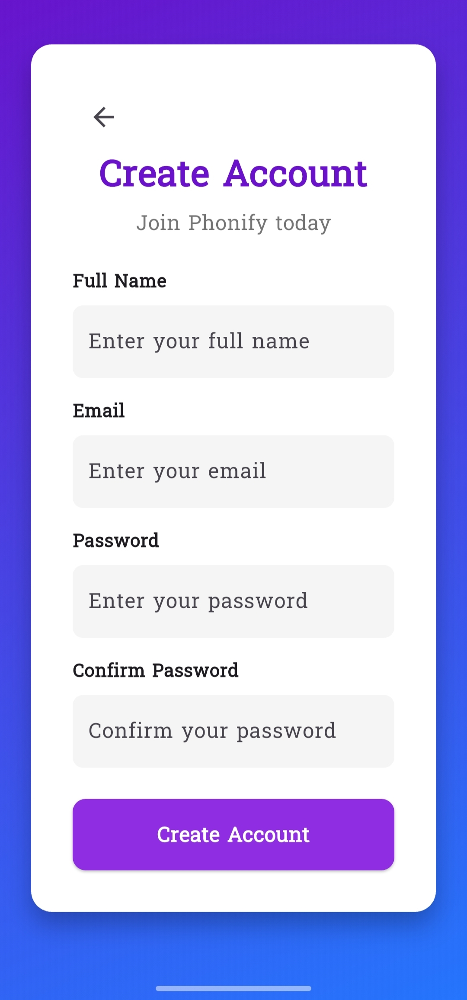

# Phonify - Flutter Shopping App

Phonify is a modern, responsive Flutter shopping application designed for an engaging user experience. It supports English and Arabic languages with seamless localization, offering product browsing, cart management, favorites, authentication, and more.

---

## Table of Contents
- [Features](#features)
- [Screenshots](#screenshots)
- [Installation](#installation)
- [Usage](#usage)
- [Localization](#localization)
- [Project Structure](#project-structure)
- [Technologies Used](#technologies-used)
- [License](#license)

---

## Features

- User Authentication (Sign Up / Sign In)  
- Multi-language support (English & Arabic)  
- Product browsing with detailed pages  
- Favorites and Cart management  
- Responsive UI with hover animations (for web)  
- Smooth transitions and error handling  
- Clean and maintainable codebase using Provider for state management  

---

## Screenshots

### English Version

| Welcome Screen          | Sign In Screen           | Sign Up Screen           | Home Screen             |
|------------------------|-------------------------|-------------------------|-------------------------|
|  |  |  |  |

| Product Detail          | Cart Screen              | Favorite                 | Home Screen      |
|------------------------|-------------------------|--------------------------|-------------------------|
|  |  |  |  |

### Arabic Version

| شاشة الترحيب          | شاشة تسجيل الدخول        | شاشة إنشاء حساب           | الشاشة الرئيسية         |
|------------------------|-------------------------|-------------------------|-------------------------|
|  |  |  |  |

| تفاصيل المنتج           | شاشة السلة               | المفضلة               | الشاشة الرئيسية             |
|------------------------|-------------------------|-------------------------|-------------------------|
|  |  |  |  |

---

## Installation

1. Clone the repository:
   ```bash
   git clone https://github.com/yourusername/phonify.git
   cd phonify

## Usage

To run the Phonify app locally:

1. Clone the repository:

```bash
git clone https://github.com/mohamedtaha77/Phonify.git
cd Phonify
```

2. Get dependencies:
   
```bash
flutter pub get
```

3. Run the app:

```bash
flutter run
```

4. Build APK for Android:

```bash
flutter build apk --release
```

## Localization

Phonify supports both English and Arabic languages, offering full bidirectional layout support.

- Localization files are managed using Flutter's intl package.

- Translation strings are stored in .arb files inside the lib/l10n/ folder.

- A language toggle is available on the Welcome screen to switch between English and Arabic.

- All UI texts, error messages, and buttons are localized.


## Project Structure

```plaintext
phonify/
├── android/
├── assets/
│   ├── fonts/
│   │   └── Suwannaphum-Regular.ttf
│   ├── images/
│   │   └── ...
│   └── screenshots/
│       └── ...
├── ios/
├── lib/
│   ├── auth/
│   │   ├── sign_in_screen.dart
│   │   └── sign_up_screen.dart
│   ├── home/
│   │   └── home_screen.dart
│   ├── l10n/
│   │   └── app_localizations.dart
│   ├── providers/
│   │   └── auth_provider.dart
│   ├── utils/
│   │   └── dialog_utils.dart
│   └── main.dart
├── test/
├── pubspec.yaml
├── README.md
├── .gitignore
└── analysis_options.yaml


## Technologies Used

- **Flutter**  
  Cross-platform UI toolkit for building natively compiled applications for mobile, web, and desktop from a single codebase.

- **Dart**  
  Programming language optimized for building user interfaces, used as the primary language for Flutter development.

- **Provider**  
  State management solution used for managing app state in a clean and efficient way.

- **Localization (intl package)**  
  Used for internationalizing the app to support multiple languages (English and Arabic).

- **Custom Fonts**  
  Suwannaphum-Regular font integrated to enhance UI typography.

- **Android Studio / Visual Studio Code**  
  Development environments used for coding, debugging, and building the app.

- **Flutter DevTools**  
  Suite of performance and profiling tools for Flutter apps.

  ## License

This project is licensed under the MIT License - see the [LICENSE](LICENSE) file for details.

